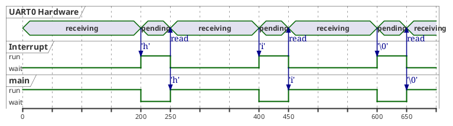
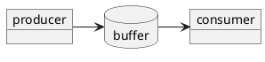
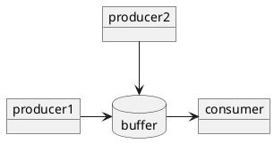
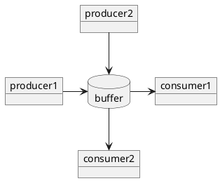
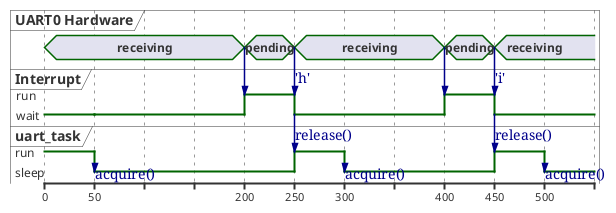

# OS Concepts for Dummies

A repository and markdown document to help give a rundown on basic OS concepts that some developers (self taught programmers, web developers, etc.) haven't seen before.

This is all written off the top of my head because the presentation will be given this week, so please forgive any inaccuracies!

## Interrupts, Tasks, Threads, Process

**Process**: An individual program made up of one or several threads. IE. int main().

**Thread**: Each thread in a process has its own control flow. They typically run in a "loop" although some may be spawned, do their work, and then quit.

**Task**: Embedded RTOS (Real-Time-Operating-System) runs "tasks" instead of threads or processes, but the concepts are the same as threads. The difference is that RTOS Tasks are generally defined at compile time when building the software together with the embedded RTOS, linking the RTOS files with the application source code itself.

**Interrupt**: In an embedded system, interrupts are generally triggered by external stimulii such as a character received on a UART, a hardware timer, a Chip Select pin going low, etc. The interrupt will, as it is named, interrupt whatever task is currently running, quickly handle the event, and then exit.

## Race Conditions

Race conditions are any kind of error that can occur when the timing of two or more threads or processes sharing the same resource can cause the behaviour to differ, usually resulting in an error or crash.

### Single Threaded

Single threaded programs have a direct, synchronous flow from start to end (or from main to exit.)

In single-threaded programs, all resources can only be accessed or modified by that single thread, so no conflicts can occur.

### Multi Threaded

Regardless of processor architecture, multi-threaded programs can have multiple "threads" of a program running "simultaneously." Even if the CPU is only running one thread at a time, each thread can be interrupted and another thread resumed at any point, so the big picture is that all threads are executing simultanously (aka concurrently). Of course, on a multiple-core or hyper-threaded architecture, the threads are **literally** concurrent.

### Interrupts

For the sake of visualization, we will use an embedded RTOS example.

In this first example, a simple receiver program where a single byte is received from the interrupt routine, which is triggered by a UART (AKA Serial Port) peripheral.

Note, this code is not secure. Let's ignore buffer and stack overflows for now.

#### Interrupt Service Routine RTOS Example

The program below is a very simple example to introduce the concept of an ISR.

```cpp

// Shared with the interrupt service routine
char _rxchar = 0;
bool _rxflag = false;

```

Below, a typical "embedded" way to map hardware into C++ code - by pointers to hardcoded register addresses for the peripheral.

```cpp
// Hardware address of the serial port
#define UART0_RX_PTR ((volatile char *)0x55448822)

```

An extremely simple Interrupt Service Routine might simply read the hardware register (which clears the ISR pending flag in the UART) and move it to another location.

```cpp

// Interrupt service routine, triggered by UART0 hardware receiving a byte.
static void uart0_isr(){
    _rxchar = *UART0_RX_PTR;    // This read also triggers the UART to clear it's pending flag
    _rxflag = true;             // Indicate to main program that it can run
}

```

The main program consumes 100% CPU, running continuously and checking the \_rxflag variable.

```cpp


// Main program
int main(int argc, char *argv[]){

    char rxbuf[256];
    int rxidx = 0;

    // Set up the UART, give it pointer to the ISR.
    uart0_setup(uart0_isr);

    // 100% CPU usage
    while(true){
        // If a character is received, add it to rxbuf and print if a full string is received.
        if (_rxflag){
            _rxflag = 0;
            rxbuf[rxidx++] = _rxchar;

            if ('\0' == _rxchar){
                std::cout << "Received " << rxbuf << " from UART." << std::endl;
                rxidx = 0;
            }
        }
    }
}
```

The interrupt and the main program are running "simultaneously" in the RTOS. How? The RTOS will automatically switch to the ISR when the UART triggers an interrupt. This will run the ISR to handle the hardware interrupt, and switch immediately to back the main program.



##### Race Condition

It is important to note that we have already introduced a race condition into this tiny program.

Have you found it?

The ISR code is "atomic" from the point of view of the main program. In other words, the ISR has higher priority than the main program and will always set both values before exiting.

```cpp

// Interrupt service routine always runs to completion when it is triggered.
static void uart0_isr(){
    _rxchar = *UART0_RX_PTR;    // This read also triggers the UART to clear it's pending flag
    _rxflag = true;             // Indicate to main program that it can run
}

```

What happens if another interrupt occurs from the UART after \_rxflag is cleared but before \_rxchar is read?

```cpp
        if (_rxflag){
            _rxflag = 0;

            // an interrupt can occur right here, cause these two instructions to run...
            // _rxchar = *UART0_RX_PTR;    // This read also triggers the UART to clear it's pending flag
            // _rxflag = true;             // Indicate to main program that it can run

            rxbuf[rxidx++] = _rxchar;

            // ...
        }
```

**Answer**: We will lose a character, because the ISR will have overwritten \_rxchar before main() had a chance to fetch the previous character.

To prevent this, we can add a "critical section," which will prevent the interrupt from running during a very tiny portion of code. Critical sections should be very small and quick, because they introduce interrupt latency. Interrupt latency is the time between when the hardware interrupt is triggered, and the time when the ISR starts running.

```cpp
        bool gotNull = false;
        EnterCriticalSection();
        // The interrupt cannot trigger between the Enter() and Exit() calls.
        if (_rxflag){
            _rxflag = 0;
            rxbuf[rxidx++] = _rxchar;
            gotNull = ('\0' == _rxchar);
        }
        ExitCriticalSection();

        // Now the interrupt can run again.  gotNull can be set by our critical section area.
        if (gotNull){
            std::cout << "Received " << rxbuf << " from UART." << std::endl;
            rxidx = 0;
        }
```

##### Conclusion

Critical Sections can be used to prevent an ISR from running during a very tiny "atomic" portion of your code. In general, try to avoid critical sections as they introduce interrupt latency. If you do use a critical section, ensure it is as tiny and fast as possible.

### Producer/Consumer

The interrupt example above fits the classic "producer/consumer" model - where one task, the ISR, produces data and another task, the main program, is the consumer of the data.

Producer/consumer models are the perfect model for demonstrating all of these "shared resource" concepts because you generally have one or many producers queuing data in some way, and one or several consumers dequeuing that data and using it.



There may also be multiple producers and one consumer.



There may also be multiple producers and multiple consumers.



You get the point...

### Semaphores

Counting Semaphores are typically used for signaling between two threads that an event is ready to run. A task or thread that "pends" or "waits" for the semaphore will be paused by the OS, consuming no CPU.

https://en.cppreference.com/w/cpp/thread/counting_semaphore
https://en.cppreference.com/w/cpp/container/queue

We'll start by adding a semaphore to the previous embedded program to prevent 100% CPU usage. We'll also use a **circular buffer** as a FIFO so multiple bytes can be queued in the ISR.

```cpp

// Shared with the interrupt service routine
IsrSafeCircularBuffer <char> _rxFifo;
std::counting_semaphore _rxflag{0};

// Interrupt service routine, triggered by UART0 hardware receiving a byte.
static void uart0_isr(){
    _rxFifo.push_back(*UART0_RX_PTR);   // Push the new item onto the queue
    _rxflag.release();                  // Release uart_task!
}

```

The uart_task thread now sleeps until there is something to process, no longer consuming 100% CPU

```cpp
int uart_task(){

    char rxbuf[256];
    int rxidx = 0;

    // Set up the UART, give it pointer to the ISR.
    uart0_setup(uart0_isr);

    while(true){

        // ** Puts the task to sleep until there is something to process**
        _rxflag.acquire();
        // We only get here if _rxFlag has been signaled!

        // Fetch character and add to rxbuf
        const char c = _rxFifo.pop_front();
        rxbuf[rxidx++] = c;

        if ('\0' == c){
            std::cout << "Received " << rxbuf << " from UART." << std::endl;
            rxidx = 0;
        }
    }
}
```

Look at the code above. How do we know that there will always be a character to fetch from the queue in \_rxFifo?

```cpp
        const char c = _rxFifo.pop_front();
        rxbuf[rxidx++] = c;
```

**Answer** Because the std::counting_semaphore has hooks to the OS in it that guarantee that the task calling acquire() will only run if the counting_semaphore has been released > 0 times.

Using the counting semaphore means that our task now only runs if there is data in the queue to process.



During "sleep" above, uart_task will enter a sleeping state in the OS, allowing other tasks to run. If there are no other tasks to run, an embedded system will enter a low-power "idle" state, waiting for the next event to wake up a task.
