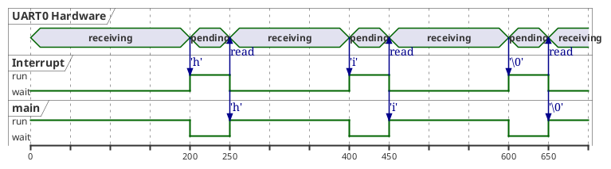

# os-concepts-for-dummies

A repository and markdown document to help give a rundown on basic OS concepts that some developers (self taught programmers, web developers, etc.) haven't seen before.

This is all written off the top of my head because the presentation will be given this week, so please forgive any inaccuracies!

## Interrupts, Tasks, Threads, Process

Process: An individual program made up of one or several threads. IE. int main().

Thread: Each thread in a process has its own control flow. They typically run in a "loop" although some may be spawned, do their work, and then quit.

Task: Embedded RTOS (Real-Time-Operating-System) runs "tasks" instead of threads or processes, but the concepts are the same as threads. The difference is that RTOS Tasks are generally defined at compile time when building the software together with the embedded RTOS, linking the RTOS files with the application source code itself.

Interrupt: In an embedded system, interrupts are generally triggered by external stimulii such as a character received on a UART, a hardware timer, a Chip Select pin going low, etc. The interrupt will, as it is named, interrupt whatever task is currently running, quickly handle the event, and then exit.

## Race Conditions

Race conditions are any kind of error that can occur when the timing of two or more threads or processes sharing the same resource can cause the behaviour to differ, usually resulting in an error or crash.

### Single Threaded

Single threaded programs have a direct, synchronous flow from start to end (or from main to exit.)

In single-threaded programs, all resources can only be accessed or modified by that single thread, so no conflicts can occur.

### Multi Threaded

Regardless of processor architecture, multi-threaded programs can have multiple "threads" of a program running "simultaneously."

#### Interrupts

For the sake of visualization, we will use an embedded RTOS example.

In this first example, a simple receiver program where a single byte is received from the interrupt routine.

Note, this code is not secure. Let's ignore buffer and stack overflows for now.

#### Interrupt Code

The volatile flags below tell the compiler that these variables can be changed outside of the main application, like from an internet service routine, so the compiler will never use cached values.

```cpp

// Shared with the interrupt service routine
volatile char _rxchar = 0;
volatile bool _rxflag = false;

```

Below, a typical "embedded" way to map hardware into C++ code - by pointers to hardcoded register addresses for the peripheral.

```cpp
// Hardware address of the serial port
#define UART0_RX_PTR (uint8_t *)0x55448822

```

An extremely simple Interrupt Service Routine might simply read the hardware register (which clears the ISR pending flag in the UART) and move it to another location.

```cpp

// Interrupt service routine, triggered by UART0 hardware receiving a byte.
static void uart0_isr(){
    _rxchar = *UART0_RX_PTR;    // This read also triggers the UART to clear it's pending flag
    _rxflag = true;             // Indicate to main program that it can run
}

```

The main program consumes 100% CPU, running continuously and checking the uncached \_rxflag variable.

```cpp


// Main program
int main(int argc, char *argv[]){

    char rxbuf[256];
    int rxidx = 0;

    // Set up the UART, give it pointer to the ISR.
    uart0_setup(uart0_isr);

    while(true){
        // If a character is received, add it to rxbuf and print if a full string is received.
        if (_rxflag){
            _rxflag = 0;
            const char c = _rxchar;
            rxbuf[rxidx++] = c;

            if (0 == c){
                std::cout << "Received " << rxbuf << " from UART." << std::endl;
                rxidx = 0;
            }
        }
    }
}
```

The interrupt and the main program are running "simultaneously" in the RTOS. How? The RTOS will automatically switch to the ISR when the UART triggers an interrupt. This will run the ISR to handle the hardware interrupt, and switch immediately to back the main program.



#### Race Condition

It is important to note tht we have already introduced a race condition into this tiny program.

Have you found it?

The code below will be "atomic" from the point of view of the main program. In other words, the ISR has higher priority than the main program and will always set both values before exiting.

```cpp

// Interrupt service routine, triggered by UART0 hardware receiving a byte.
static void uart0_isr(){
    _rxchar = *UART0_RX_PTR;    // This read also triggers the UART to clear it's pending flag
    _rxflag = true;             // Indicate to main program that it can run
}

```

However, the main program has an issue...

What happens if another interrupt occurs from the UART after \_rxflag is cleared but before \_rxchar is read? We will lose a character.

```cpp
        if (_rxflag){
            _rxflag = 0;

            // an interrupt can occur right here, cause these two instructions to run...
            // _rxchar = *UART0_RX_PTR;    // This read also triggers the UART to clear it's pending flag
            // _rxflag = true;             // Indicate to main program that it can run

            const char c = _rxchar;

            // ...
        }
```

To prevent this, we can add a "critical section," which will prevent the interrupt from running during a very tiny portion of code. Critical sections should be very small and quick, because they introduce interrupt latency.

```cpp
        bool gotNull = false;
        EnterCriticalSection();
        // The interrupt cannot trigger between the Enter() and Exit() calls.
        if (_rxflag){
            _rxflag = 0;
            const char c = _rxchar;
            rxbuf[rxidx++] = c;
            gotNull = (0 == c);
        }
        ExitCriticalSection();

        // Now the interrupt can run again.
        if (gotNull){
            std::cout << "Received " << rxbuf << " from UART." << std::endl;
            rxidx = 0;
        }
```
